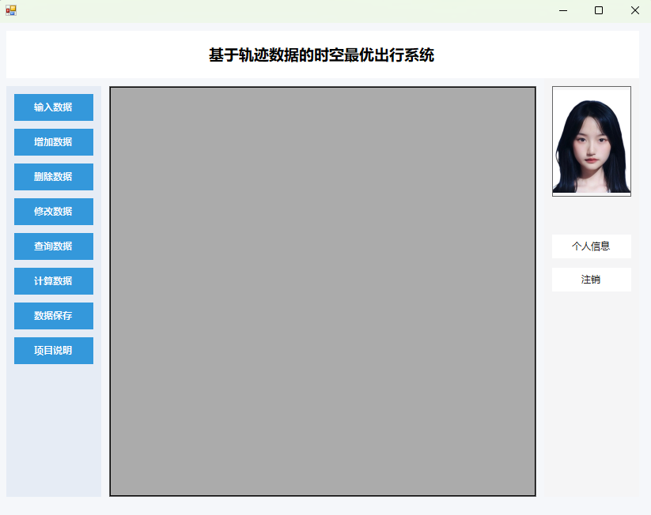
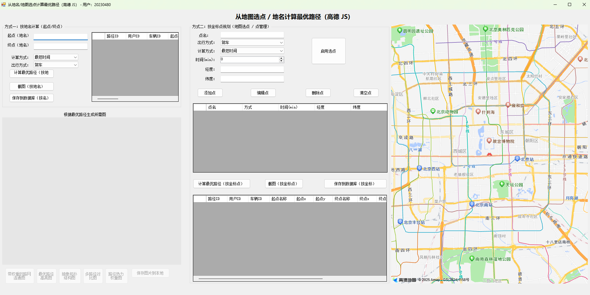
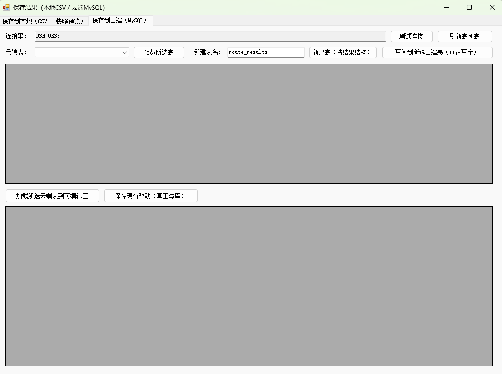
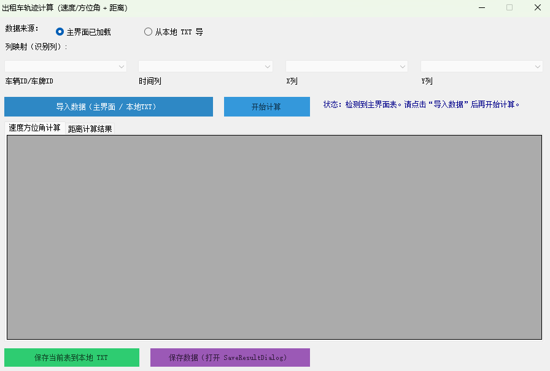

# 基于轨迹数据的时空最优出行方案设计与实现

这是我在专业课程设计中完成的一个桌面端项目。项目主要围绕出租车轨迹数据和路网数据，完成了轨迹计算、路径规划和结果展示等功能。

项目使用 **C# WinForms** 开发，数据库采用 **Access**，通过 **ODBC** 连接。整个过程包括数据入库、界面开发、算法实现、功能整合和最终运行测试。

## 项目内容

这个系统主要完成了以下几部分功能：

- 用户登录和注册
- 轨迹数据、路网数据的导入与管理
- 轨迹速度、方位角、累计距离等指标计算
- 基于 Dijkstra 算法的最短路径规划
- 地图选点、路线展示、结果保存与导出

路径规划部分支持两种方式：

- 最短距离
- 最短时间

## 我在项目中的工作

我在这个项目中担任组长，主要负责：

- 项目整体规划和任务分工
- 功能整合与进度推进
- 系统联调与测试
- 最终成果整理与提交

在实现过程中，我更关注的是系统能不能真正跑通，所以后期在模块整合、测试和收尾上投入了比较多时间。

## 技术栈

- C#
- WinForms
- Access
- ODBC
- Visual Studio 2022
- .NET Framework 4.7.2

## 项目界面展示

### 1. 登录界面
系统支持用户登录，作为各功能模块的统一入口。

### 2. 系统主界面
主界面采用左侧功能导航的形式，便于进入不同业务模块。

### 3. 地图与路径规划界面
系统支持地图展示和路径规划，可结合路网数据进行结果输出。

### 4. 结果表展示
系统能够对计算或查询结果进行表格化展示，方便查看和后续处理。

### 5. 最短路径算法图
该图用于展示最短路径相关算法结果和节点关系。

## 算法与处理思路

项目中主要用了两类处理思路：

### 1. 轨迹数据计算
对轨迹点按时间顺序进行处理，计算：

- 相邻点距离
- 速度
- 方位角
- 累计距离
- 首尾直线距离

### 2. 路径规划
把路网抽象成带权图，使用 **Dijkstra 算法** 计算起点到终点的最优路径，并根据不同权值输出最短距离或最短时间结果。

## 项目收获

这个项目让我比较系统地把数据库设计、桌面端界面开发、算法实现和功能整合串到了一起。相比单独写某一个模块，这次更像是在做一个能够完整运行的程序。

## 运行方式

1. 使用 Visual Studio 2022 打开 `TrafficSystem.sln`
2. 配置好 Access 数据库和 ODBC 数据源
3. 确保本机已安装相关运行环境
4. 运行项目

## 说明

这是一个课程设计项目，重点在于完成从需求分析、数据库设计、功能实现到系统发布的完整过程。
